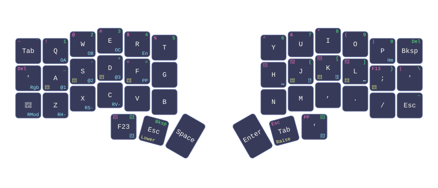

# dotfiles

Declarative macOS configuration using **nix-darwin** and **Home Manager** with Flakes. This repository contains my personal dotfiles optimized for developer productivity with a focus on keyboard-first workflows.

## Quick Start

```bash
# Apply configuration to current host
sudo nix run nix-darwin/master#darwin-rebuild -- switch --flake .#workstation

# Dry-run (see what would change)
sudo nix run nix-darwin/master#darwin-rebuild -- build --flake .#workstation

# Update inputs to latest versions
nix flake update

# Rollback to previous generation
sudo nix run nix-darwin/master#darwin-rebuild -- switch --rollback
```

## Architecture

This repository uses a **five-layer architecture** for clear separation of concerns:

```
flake.nix (orchestration)
├── hosts/workstation/     → macOS with unstable nixpkgs (latest packages)
└── hosts/homelab/         → macOS 13 with stable nixpkgs (compatible packages)
    ├── default.nix        → darwin system configuration
    ├── home.nix           → Home Manager user configuration
    └── homebrew.nix       → Homebrew packages & casks
        │
        └── modules/
            ├── darwin/    → System-level settings (dock, keyboard, etc.)
            ├── home/      → Shell, git, SSH, development tools
            └── programs/  → Self-contained GUI apps with config directories
```

### Module Pattern

Each program is **self-contained** with a standard structure:

```
modules/programs/neovim/
├── default.nix           # Nix configuration (toggle, packages)
└── config/               # Live-editable configs (symlinked, no rebuild)
    ├── init.lua
    ├── lua/
    └── plugins.lua
```

- `default.nix` defines the toggle (`my.neovim.enable = true;`) and imports
- `config/` directory is symlinked live (changes take effect immediately without rebuild)
- This separates declarative configuration from live editing

# Features

## Home Row Mods (CACS)

Transform your keyboard into a comfort machine by holding letter keys to trigger modifiers. This eliminates pinky stretching to modifier keys—your fingers stay on the home row.

### Dual Implementation

Home row mods are implemented across two keyboards and systems:

1. **External Keyboard (ZMK Firmware)**
   - Device: Corne-ish Zen split keyboard
   - Config: `zmk/config/corne-ish_zen.keymap`
   - Implementation: ZMK keyboard firmware with home row mod behaviors

2. **MacBook Built-in Keyboard (Karabiner)**
   - Device: Built-in MacBook keyboard
   - Config: `modules/programs/karabiner/config/homerow.json`
   - Implementation: Karabiner Elements dual-role keys

### Karabiner Configuration (MacBook Keyboard)

The MacBook keyboard uses Karabiner Elements for CACS (Command-Alt-Ctrl-Shift) home row mods:

**Left-hand mods (home row):**
```
A → Cmd (Command)
S → Alt (Option)
D → Ctrl (Control)
F → Shift
```

**Right-hand mods (home row):**
```
J → Shift
K → Ctrl (Control)
; → Cmd (Command)
```

**Dual-role key behavior:**
- **Hold** key = acts as modifier
- **Tap** key = types the letter normally
  - Tap `A` = types `a`
  - Hold `A` + press `C` = `Cmd+C` (copy)
  - Hold `D` + press `Z` = `Ctrl+Z` (undo)
  - Hold `S` + press `Tab` = `Alt+Tab` (switch apps)

### ZMK Configuration (External Corne-ish Zen)

The external Corne-ish Zen split keyboard uses ZMK firmware with layers for modifier access. See `zmk/config/corne-ish_zen.keymap` for detailed keymap configuration across QWERTY, LOWER, RAISE, and CONFIG layers.

## Major Applications & Tools

### Terminal & Shell

| Application | Config Location | Purpose |
|------------|-----------------|---------|
| **zsh** | `modules/home/zsh/` | Modern shell with async prompt |
| **starship** | zsh config | Fast, minimal prompt |
| **kitty** | `modules/programs/kitty/config/` | GPU-accelerated terminal |
| **alacritty** | `modules/home/alacritty/` | Cross-platform terminal |
| **tmux** | `modules/home/tmux/config/` | Terminal multiplexer |
| **atuin** | `modules/home/atuin.nix` | Elegant shell history |

### Editors & Development

| Application | Config Location | Purpose |
|------------|-----------------|---------|
| **Neovim** | `modules/home/editor/` | Extensible text editor |
| **GitHub Copilot CLI** | `modules/programs/copilot/config/` | AI coding assistant |
| **Python/Node/.NET/Flutter** | `modules/home/*.nix` | Language toolchains |

### Window Management & UI

| Application | Config Location | Purpose |
|------------|-----------------|---------|
| **AeroSpace** | `modules/programs/aerospace/config/` | Tiling window manager |
| **JankyBorders** | `modules/programs/borders/config/` | Window borders decorator |
| **SketchyBar** | `modules/programs/sketchybar/config/` | Customizable status bar |
| **Raycast** | `modules/home/raycast.nix` | App launcher & productivity |
| **Maccy** | `modules/home/maccy.nix` | Clipboard manager |

### Keyboard & Input

| Application | Config Location | Purpose |
|------------|-----------------|---------|
| **Karabiner Elements** | `modules/programs/karabiner/config/` | Key remapping (home row mods) |

### Productivity & Utilities

| Application | Config Location | Purpose |
|------------|-----------------|---------|
| **Obsidian** | `modules/programs/obsidian/config/` | Note-taking & knowledge base |
| **ncspot** | `modules/home/ncspot/` | Spotify CLI client |
| **HTTPie** | `modules/home/httpie/` | HTTP CLI client |
| **git** | `modules/home/git/` | Version control |
| **ssh** | `modules/home/ssh/` | Secure shell |

### Cloud & DevOps

- **Kubernetes**: `modules/home/cloud-k8s/` 
- **Netskope VPN**: `modules/home/netskope.nix`

# Git

## Submodule visibility

This repository uses Git submodules (e.g. `opencode/skills/obsidian-skills`).
By default, `git status` only shows a vague `(modified content)` message when a
submodule has uncommitted changes, giving no indication of what actually changed
inside it.

`diff.submodule = log` is configured in `modules/home/git.nix` to make `git
status` embed a diff summary directly in the output so you can see exactly which
files changed inside the submodule without having to `cd` into it.

### Example output

```
$ git status
On branch nix-migration

Changes not staged for commit:

	modified:   opencode/skills/obsidian-skills (modified content)

Submodule opencode/skills/obsidian-skills contains modified content
--- a/opencode/skills/obsidian-skills
+++ b/opencode/skills/obsidian-skills
@@ -1 +1 @@
-Subproject commit 243259970868a2599486c859d040f295b986e24b
+Subproject commit 243259970868a2599486c859d040f295b986e24b-dirty
Submodule opencode/skills/obsidian-skills/skills/obsidian-cli is dirty
diff --git a/skills/obsidian-cli/SKILL.md b/skills/obsidian-cli/SKILL.md
index ec4a683..d5e6837 100644
--- a/skills/obsidian-cli/SKILL.md
+++ b/skills/obsidian-cli/SKILL.md
@@ -1,5 +1,5 @@
 # Obsidian CLI Skill

-This skill enables interactions with Obsidian vaults via the Obsidian CLI (`obs`).
+This skill enables extended interactions with Obsidian vaults via the Obsidian CLI (`obs`).
 It provides tools to read, create, search, and manage notes, tasks, and more.
```

# Legacy: AUR Package Maintenance (Arch Linux Era)

This section is kept for historical context. These tools were used when this repository was for Arch Linux configuration.

I was maintaining a [few dozen AUR packages](https://aur.archlinux.org/packages/?K=pjvds&SeB=m) for Arch Linux with a daily CI job checking for outdated packages:

* `aurpublish` - Install githooks for package repository
* `updpkgsums` - In-place update of checksums
* `nvchecker` - Check for new versions ([config](nvchecker/nvchecker.toml))
* `nvcmp` - Compare version state files from nvchecker
* `nvtake <pkg_name>` - Accept the new version

Configuration lives in `nvchecker/nvchecker.toml` and is kept for archive purposes.

# Keyboard

My daily driver is a Corne (CRKBD) split keyboard running QMK with the "born2code" layout. Its column-staggered, low key-count layout lets my fingers move towards the keys instead of my fingers moving to reach them.

Combined with home row mods, this setup eliminates almost all hand movement for typing and hotkeys.



The base layer is shown above, with the Lower/Raise/Adjust layer legends folded into each key's corners. See `via/scripts/generate_keymap.py` for the generator, which turns the VIA export (`via/crkbd.layout.json`) into this image via [`keymap-drawer`](https://github.com/caksoylar/keymap-drawer).

## Hardware Specs

* **Corne R2G PCB** — split ergonomic keyboard
* **Corne Max case** ([site](https://mechboards.co.uk/products/corne-max)) with dampening foam and a frosted acrylic bottom that complements the RGB underglow
* **Gateron Clear** switches (Linear | Ultra-light | 35g Actuation)
* **MiTo MT3 Cyber keycaps** (MX style | Doubleshot Legends | Hi-Profile)

## Home Row Mods

See the [Features → Home Row Mods section](#home-row-mods-cacs) above for detailed explanation and key mappings.
